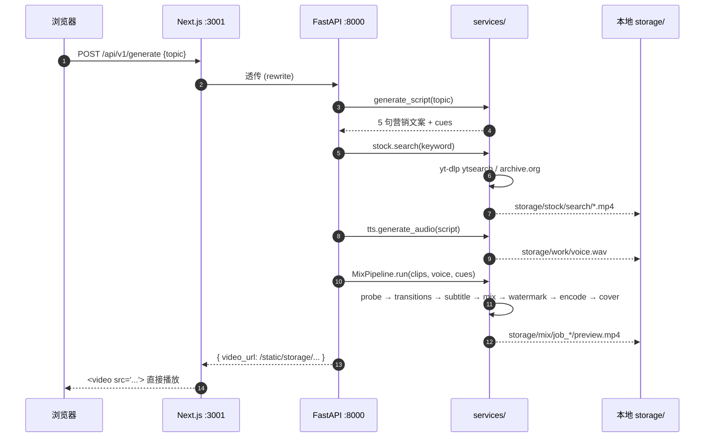
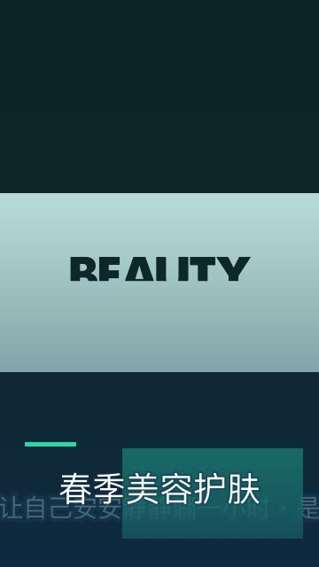

# ShadowBlade

> **企业级 AI 短视频生成 SaaS** · 一句主题 → 真画面成片 · Next.js 14 + FastAPI + ffmpeg


输入一句"春季美容补水套餐 - 新客首单 5 折"，10–20 秒之后浏览器里出来一段能直接发抖音/小红书的 MP4 — 自带营销文案、配音、字幕、品牌水印、封面、智能过渡。

完整 demo 视频：[demo/demo-skincare-24s.mp4](demo/demo-skincare-24s.mp4)（4.6 MB · 24 秒）

---

## ⚡ 它能干什么

```
┌──────────┐   ┌──────────┐   ┌──────────┐   ┌──────────┐   ┌──────────┐
│ 商家主题 │ → │ LLM 脚本 │ → │ TTS 配音 │ → │ ASR 字幕 │ → │  混剪    │ → MP4
└──────────┘   └──────────┘   └──────────┘   └──────────┘   └──────────┘
                   ↑               ↑               ↑              ↑
              模板生成器       edge-tts        faster-whisper   ffmpeg
              （8 个场景）     （免费、无 key）  （本地 base 74MB）  +
                                                                智能过渡
                                                                调色 LUT
                                                                BGM ducking
                                                                品牌水印
                                                                + 自动封面
```

**真画面素材**通过 **关键词爬取**（无 API key）：
- `yt-dlp` 的 `ytsearch:` 抓 YouTube
- `archive.org` 开放搜索 API 兜底（国内可达）
- 用户也可以贴任意 URL（B 站 / 抖音 / 任何 yt-dlp 支持的 ~1500 站）

---

## 🚀 30 秒本地跑

```bash
git clone https://github.com/zhongrenfei1-hub/shadowblade.git
cd shadowblade

make install         # Python venv + pip install (ffmpeg/edge-tts/whisper/yt-dlp)
make install-next    # npm install
make next            # 同时起后端 :8000 + 前端 :3001
```

浏览器开 **http://localhost:3001/studio**，输入主题，点 **「立即生成视频」**。

## ☁️ 部署到生产

前端 **Vercel** + 后端 **Railway / Render / Fly** 三选一。完整 5 分钟流程见 [DEPLOY.md](DEPLOY.md)。

> Vercel 不能跑后端（serverless 60s 超时 + 没 ffmpeg + 没持久 storage）。本仓库带了 `backend/Dockerfile`、`railway.json`、`render.yaml`、`fly.toml`，三家任选一家点一下就部署完。

---

## 🎬 完整使用流程

### 第 1 步：进入 Studio

打开 `http://localhost:3001/studio`，看到这个：

```
🪄 AI 一键生成     ←  默认模式：主题 → MP4
🎚️ 手动混剪        ←  专家模式：直接调素材/字幕/过渡
```

### 第 2 步：选素材来源

```
🔍 关键词爬取   ←  无需 key，推荐
🔗 自定义 URL   ←  贴 YouTube/B 站 URL → yt-dlp 下载
📦 内置示例    ←  彩条测试图
🌐 Pexels      ←  需 API key（pexels.com/api，免费 1 分钟注册）
```

### 第 3 步：填表

- **主题** — 一句话，越具体越好（"春季美容护肤套餐 5 折"）
- **配音音色** — 晓晓女声 / 云扬男声 / 晓伊女声 / 云夏男声 / 晓萱女声
- **输出格式** — 9:16 竖屏 / 16:9 横屏 / 1:1 方形
- **调色 LUT** — 自然 / 暖调 / 冷调 / 电影感 / 高对比
- **脚本字数** — 80–400 字滑动条（影响视频时长）
- **关键词**（爬取模式）— 留空用主题，或自己填英文（`skincare`/`coffee shop`/`nail salon`）

### 第 4 步：点立即生成

右侧 5 步进度可视化：

```
✓ 拉素材       (10–120 秒 · 看素材库快慢)
✓ 脚本生成      ( <1 秒 · smart template)
✓ 配音 edge-tts  (3–8 秒 · 长脚本更慢)
✓ 字幕识别      (跳过 OR faster-whisper 5–10 秒)
✓ 智能混剪      (5–15 秒 · VideoToolbox GPU 加速)
✓ 封面          ( <1 秒)
```

### 第 5 步：看片 + 下载

右下出现 `<video>` 直接播放 + "下载 MP4" 链接 + 脚本 + hashtag + 警告面板。

---

## 🧩 架构

### 后端 services 模块

| 模块 | 作用 |
|---|---|
| `services/video/probe.py` | ffprobe 包装 — 元数据 + BS.1770 LUFS |
| `services/video/transitions.py` | 智能过渡选择 — fade/fadeblack/fadewhite/dissolve/smooth\*/hblur |
| `services/video/subtitle.py` | 字幕智能断句 + SRT/ASS 导出 + CPS 质量评分 |
| `services/video/audio.py` | 双轨混音 — sidechain ducking + LUFS 归一化 + 自适应 BGM |
| `services/video/pacing.py` | silencedetect → 智能切分镜头 |
| `services/video/beat.py` | 纯 Python BPM + onset 检测（不依赖 librosa）|
| `services/video/color.py` | 7 种 LUT 预设 + .cube LUT 加载 + 自动白平衡 |
| `services/video/ken_burns.py` | 静图 zoompan 推拉 4 种预设 |
| `services/video/speed.py` | 变速 0.1× – 8×（setpts + atempo 链式）|
| `services/video/aspect.py` | 多比例自适应（pad / crop / blur_bg）|
| `services/video/watermark.py` | 品牌水印 + 时序控制（开头/结尾/脉冲）|
| `services/video/covers.py` | 封面提取 + 品牌渐变 + 标题叠加 |
| `services/video/text_render.py` | Pillow 文字栅格化（libass 缺失时的回退）|
| `services/video/features.py` | ffmpeg 能力探测 |
| `services/video/encoder.py` | 编码预设（社交/横屏/方形/预览）|
| `services/video/pipeline.py` | **MixPipeline 主编排器** |
| `services/llm/script_generator.py` | LLM 替身 — 8 场景模板（美容/美甲/SPA/咖啡/健身/咨询/开业/默认）|
| `services/audio/tts.py` | edge-tts 包装（5 个中文音色）|
| `services/audio/asr.py` | faster-whisper 包装（懒加载 base 模型）|
| `services/stock/pexels.py` | Pexels Videos API 客户端 |
| `services/stock/youtube.py` | yt-dlp 通用 URL 下载 |
| `services/stock/searcher.py` | 关键词爬取（ytsearch + archive.org 兜底）|

### API 端点

```
GET  /api/v1/health                    健康检查 (ffmpeg + 配置状态)
POST /api/v1/generate                  一键端到端 (topic + clips → MP4)
GET  /api/v1/generate/jobs/{id}        轮询异步任务状态
POST /api/v1/generate/script           LLM 脚本生成
POST /api/v1/generate/audio            edge-tts 配音
POST /api/v1/generate/subtitle         faster-whisper 字幕识别
POST /api/v1/generate/cover            ffmpeg 封面提取
GET  /api/v1/generate/scenarios        列出 8 个场景模板
GET  /api/v1/generate/voices           列出 5 个 TTS 音色
POST /api/v1/mix-video/preview         同步 360p 预览
POST /api/v1/mix-video                 异步混剪 (1080p+)
GET  /api/v1/mix-video/tasks/{id}      查询混剪任务
POST /api/v1/mix-video/analyze/beats   音频 BPM + onsets
POST /api/v1/mix-video/analyze/subtitles  字幕 CPS 质量报告
POST /api/v1/mix-video/select-clips    智能素材选择器
GET  /api/v1/mix-video/looks/list      7 种调色 LUT
GET  /api/v1/mix-video/aspects/list    4 种比例
GET  /api/v1/mix-video/features        ffmpeg 能力探测
POST /api/v1/stock/search              关键词爬取（yt-dlp + archive.org，无 key）
POST /api/v1/stock/from-url            yt-dlp 抓任意 URL
POST /api/v1/stock/pexels/search       Pexels 搜索（需 key）
POST /api/v1/stock/pexels/auto         Pexels 自动下载 top N
GET  /api/v1/stock/status              哪些素材源已配置
GET  /api/v1/notifications             工作空间收件箱（分页 + tab 过滤）
GET  /api/v1/notifications/unread-count  Header 未读徽章计数
GET  /api/v1/notifications/types       枚举可用 type/category/kind
PUT  /api/v1/notifications/{id}/read   单条标记已读
PUT  /api/v1/notifications/read-all    一次清空（可按 category）
PUT  /api/v1/notifications/{id}/archive 软归档（保留审计）
DELETE /api/v1/notifications/{id}      硬删除
```

### 📬 工作空间通知

收件箱聚合 6 类事件：流水线（混剪成功/失败）、审批、@ 提及、品牌偏移、计费、系统。已接入触发：

- mix-video 渲染成功 / 失败 → `notify_video_generated` / `notify_video_failed`
- brand-kit 字段变更 + logo 上传 → `notify_brand_kit_changed`

helper 已就位待接入：模板发布、团队邀请、@ 提及、审批、计费。完整开发文档与扩展指引见 [docs/notifications.md](docs/notifications.md)。一键 seed demo 数据：

```bash
cd backend && .venv/bin/python -m app.services.notifications_demo
# → 写入 14 条覆盖全部 6 类的真实示例到 workspace_id=1
```

### 数据流（一键生成）



---

## 📺 演示视频

**生成的真画面成片**（24 秒 · 4.6 MB · 360×640 9:16）：

- 在线播放：[demo/demo-skincare-24s.mp4](demo/demo-skincare-24s.mp4)
- 封面：

**主题**：`春季美容护肤套餐 - 新客首单 5 折`

**关键参数**：
- 8 段 archive.org 化妆品广告画面，关键词 `skincare beauty` 自动爬取
- 晓晓女声配音（edge-tts 免费）
- cinematic LUT 调色 + 自动白平衡
- 自适应 BGM ducking（人声 ≈ -19.8 LUFS → duck 阈值 -13.8dB）
- fade + fadeblack 智能过渡
- 字幕峰值 CPS 5.91（远低于阅读上限 18）
- VideoToolbox GPU 编码

---

## 🛠️ 项目结构

```
shadowblade/
├── backend/
│   ├── app/
│   │   ├── api/                    FastAPI 路由
│   │   │   ├── generate.py            ← 一键端到端 /generate
│   │   │   ├── mix_video.py           ← 视频混剪 /mix-video
│   │   │   ├── stock.py               ← 素材爬取 /stock
│   │   │   ├── auth.py, projects.py, ...
│   │   ├── services/
│   │   │   ├── video/              ← 16 个混剪模块
│   │   │   ├── llm/                ← 脚本生成模板
│   │   │   ├── audio/              ← TTS + ASR
│   │   │   └── stock/              ← Pexels + yt-dlp + 爬取
│   │   └── main.py
│   ├── tests/video/                ← 100+ 测试，pytest
│   └── requirements.txt
├── frontend-next/
│   ├── app/(app)/studio/           ← Studio AI 一键生成 + 手动混剪
│   ├── app/(app)/dashboard, projects, ... (36 页)
│   ├── components/workspace/
│   │   ├── studio-generate.tsx       ← AI 模式 UI
│   │   ├── studio-workbench.tsx      ← 手动模式 UI
│   │   └── studio-mode-switch.tsx
│   └── lib/api.ts                  ← 类型化 API 客户端
├── storage/
│   ├── samples/                    ← 测试素材（ffmpeg 合成）
│   ├── stock/search/               ← 爬取下载的真素材
│   ├── stock/ytdlp/                ← yt-dlp 抓的 URL 素材
│   ├── work/                       ← TTS / SRT 中间产物
│   ├── final/                      ← 封面输出
│   └── mix/                        ← 成片 MP4 输出
├── demo/                           ← README 演示资产
└── Makefile
```

---

## 🧪 跑测试

```bash
cd backend
./.venv/bin/pytest tests/video/ -v
```

100+ 测试覆盖：
- probe / transitions / subtitle / audio / pacing / watermark / covers / brand / encoder
- 端到端 mix pipeline（合成测试素材 → 真 MP4 验证）
- beat detection（90/120 BPM click track）
- Ken Burns / 字幕质量评分 / 智能素材选择
- 色彩 LUT / 变速 / 多比例 / 水印分时 / 字幕入场动画
- 自适应 BGM 混音 / SRT 读写
- 脚本生成（8 场景路由 + 时长估算）
- edge-tts（在线时跑真 TTS）

---

## ⚙️ 配置（可选）

环境变量：

```bash
# 存储根目录（默认：repo 根目录的 storage/）
export SHADOWBLADE_STORAGE_ROOT=/path/to/storage

# Pexels API key（可选，只有用 Pexels 模式时需要）
export PEXELS_API_KEY=your-key-here

# CORS 允许的前端域名（默认包含 localhost:3000/3001）
export SHADOWBLADE_CORS_ORIGINS='["http://localhost:3001"]'

# JWT 密钥（生产环境务必改）
export SHADOWBLADE_JWT_SECRET=change-in-prod
```

---

## 🐛 故障排查

| 症状 | 原因 | 解决 |
|---|---|---|
| `/studio` 点生成卡在"混剪"步骤 | 后端 cwd 不对 → 找不到 storage 素材 | 用 `make next`（已修），或确保 `storage_root` 是绝对路径 |
| `libass missing` 警告 | Homebrew ffmpeg 默认不带 libass | 没事，自动回退到 Pillow PNG 字幕（无视觉差异）|
| Pexels 搜索 403 | 没设 API key | `export PEXELS_API_KEY=xxx` 重启 backend，或换用"关键词爬取"模式 |
| yt-dlp 慢 | 国外站点直连慢 | 默认走 archive.org 兜底，或加 `--cookies-from-browser chrome` |
| Vercel 上 `/studio` 点生成报错 | 生产没 ffmpeg 后端 | 只在本地能跑真混剪；Vercel 仅显示 UI |
| 视频太短（14 秒） | 素材源单段太短 → 循环到 max_shot 上限 | 拉脚本字数 > 250，或用更长素材源 |

---

## 📦 依赖

**后端**（Python 3.11+）：
```
fastapi==0.115.0      # Web framework
uvicorn==0.30.6       # ASGI server
sqlalchemy==2.0.35    # ORM (async)
pydantic==2.9.2       # Schemas
Pillow==10.4.0        # PNG fallback rendering
edge-tts==7.2.8       # 微软神经 TTS（免费）
faster-whisper==1.2.1 # ASR (CTranslate2)
yt-dlp==2025.10.27    # URL/搜索下载器
httpx==0.27.2         # HTTP client (Pexels, archive.org)
```

**系统**：
- `ffmpeg ≥ 8.x`（带 `videotoolbox` 可选，Mac GPU 加速）
- `ffprobe`

**前端**（Node 18+）：
- Next.js 14.2
- React 18
- TailwindCSS 3.4
- Radix UI primitives
- Lucide icons

---

## 🤝 致谢

API 契约参考自 [finewood2008/shadowblade](https://github.com/finewood2008/shadowblade)（Centaur AI）的 6 端点设计。本仓库的实现是从零编写，混剪能力更深（智能过渡 / LUT / 节拍 / 自适应混音 / 关键词爬取），LLM 部分用模板生成器代替（保留切换为真实 LLM 的接口）。

---

## 📄 许可

待定。当前为个人项目，请勿商用未授权部署。

